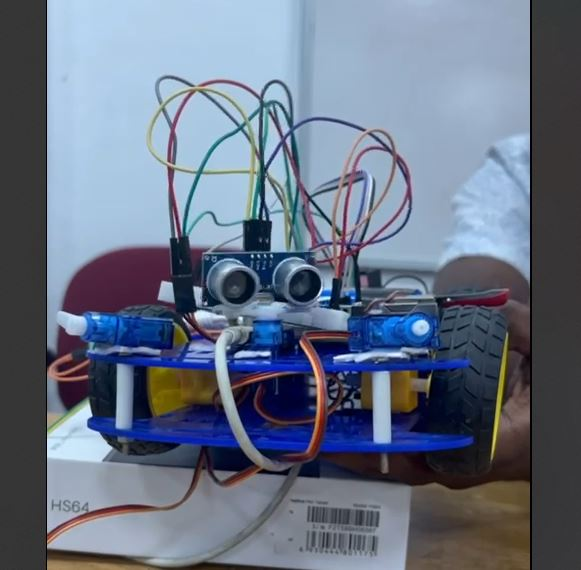

# 🤖 VANIS — Vision Test Robot

Simple robot project for camera, face, and person detection tests on Raspberry Pi and Windows.

---

## 📌 What It Does
- `cam_test.py` — camera sanity check
- `face_test.py` — face detection demo
- `person_detect_test.py` — person detection demo
- `face_body_detect.py` — optional combined face+body detection

---
## 📸 Robot Image


---
## 📸 Media

## 📸 Test Media

### 🎥 Test Videos (inline)
<video src="assets/VID-20250809-WA0002.mp4" controls width="480"></video>  
[Open video](assets/VID-20250809-WA0002.mp4)

<video src="assets/VID-20250809-WA0003.mp4" controls width="480"></video>  
[Open video](assets/VID-20250809-WA0003.mp4)

<video src="assets/VID-20250809-WA0004.mp4" controls width="480"></video>  
[Open video](assets/VID-20250809-WA0004.mp4)

<video src="assets/VID-20250809-WA0005.mp4" controls width="480"></video>  
[Open video](assets/VID-20250809-WA0005.mp4)

<video src="assets/VID-20250809-WA0006.mp4" controls width="480"></video>  
[Open video](assets/VID-20250809-WA0006.mp4)


---

## 🚀 How to Run Tests

### On Raspberry Pi / Ubuntu
```bash
git clone https://github.com/buddytex/VANIS.git
cd VANIS
python3 -m venv .venv && source .venv/bin/activate
pip install --upgrade pip
pip install opencv-python numpy
